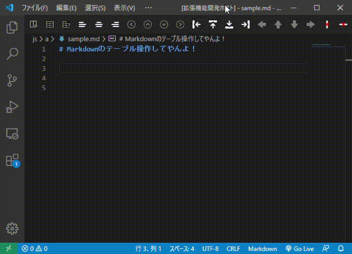
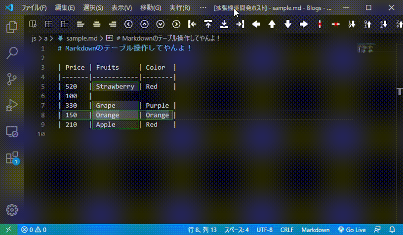
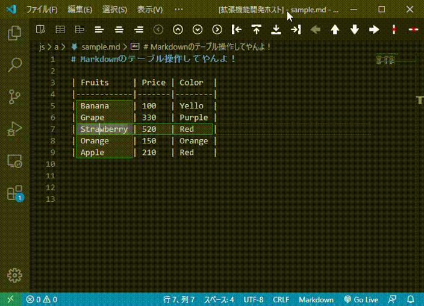
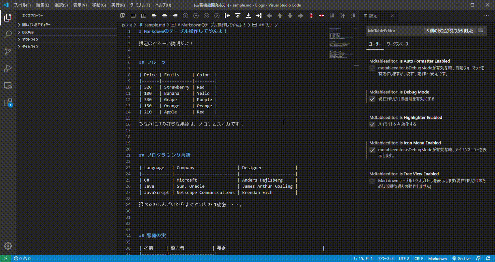

# Markdown Table Editor

テーブルの編集

## Features

マークダウンのテーブル編集を支援します。

### New create

Example: input the `3x7` and Enter Key.

行の先頭で1から9までの数字、2文字目で`x`を入力することで補完機能が働きます。
数字は二桁以上入力しても反応しません。

### Focus

* `Shift + Alt + Allow(left, right, up, down)`: セル間を移動します。

### alignment change

### Move

### Remove

### Sort

数値ソートをするときは、数値以外の行を無視します。
文字列ソートの時は空文字もソートの対象になりますが仕様は未定です。

### Multi Selection

カラム内の **空文字のセル**, **空文字以外のセル**, **全てのセル** を選択出来ます。
例えば未入力のセルのみ初期化する時などに使用します。

### Format

現在設計変更により **自然フォーマット** が **綺麗なフォーマット**と同じ動作をしてしまいます。
バグではないですが、仕様が未定です。

２つのコマンドアイコンの違いは空いたセルを埋めるかどうかです。

## Extension Settings

* `mdtableeditor.isDebugMode`: 廃止予定です。
* `mdtableeditor.isIconMenuEnabled`:　コマンドアイコンを表示します。
* `mdtableeditor.isAutoFormatterEnabled`: 自動的にフォーマットします。廃止予定です。
* `mdtableeditor.isTreeViewEnabled`: TreeViewにページ内のテーブル一覧を表示します。
* `mdtableeditor.isHighlighterEnabled`: ハイライト(緑のやつ)しないようにします。

Auto FormatterはWindows以外で動作未確認です。
開発用なので有効にしないでください。
かなり無理した作りになっているため何れ廃止します。

理由。
Auto Formatterは内部でsetTimeout()を使用しており、キーボード入力とのタイミングによりカーソル位置がズレることがあります。
大分粘りましたが解決出来ませんでした。
正しいやり方ではないと思うものの、正式な方法を探しても見つけきなかったためです。

余談：ひゃっはーと書きたかったんだー、本当は。寝不足って怖いねorz

## Known Issues

* Key Binding をほとんど設定してません。他のキーと競合してないか調べるのが面倒だったからです。
* ファイル数が多いのですが、時間がないためWebPackによるバンドルはしてません。

## Release Notes

### 0.0.1

2020/06/06 記念すべき公開日♪

-----------------------------------------------------------------------------------------------------------

開発者HP： https://incre-clover.net

開発者Twitter: https://twitter.com/clover_plpl

