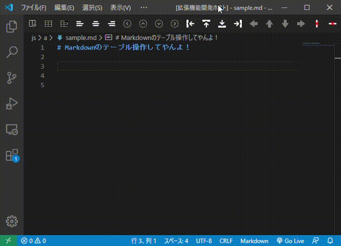
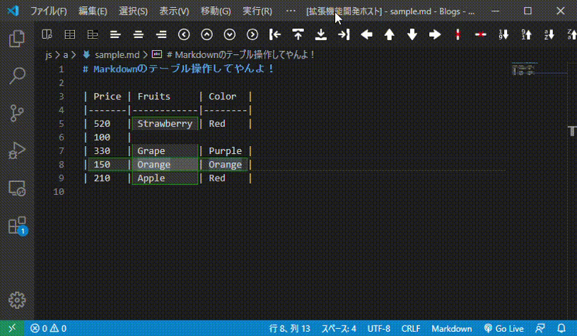
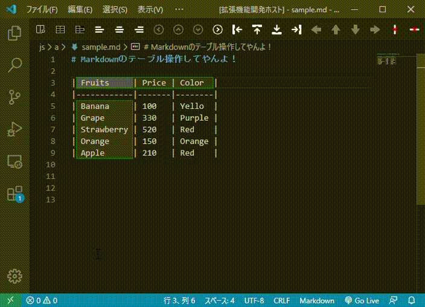
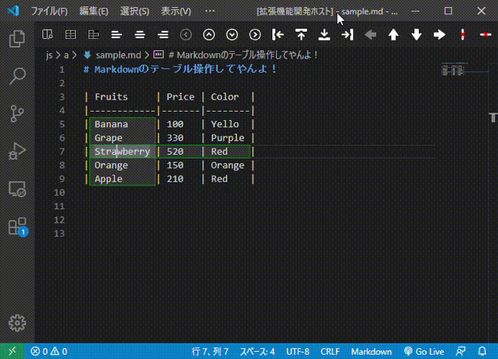
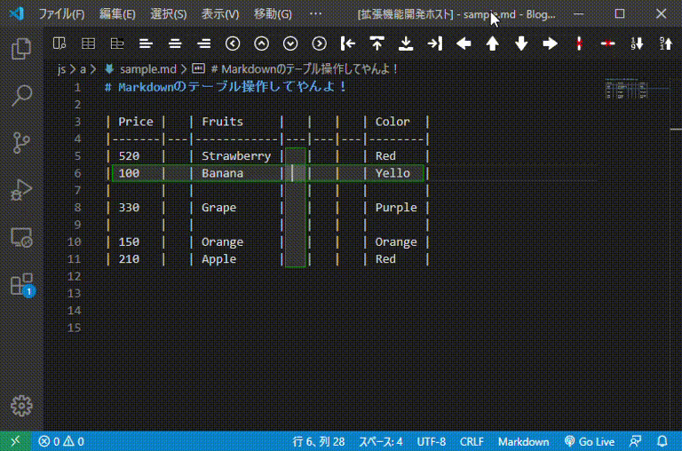
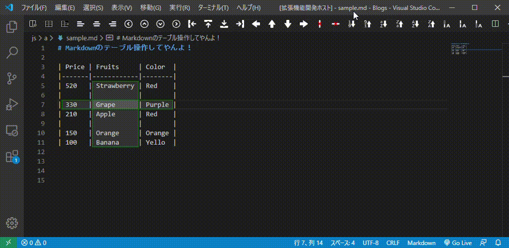
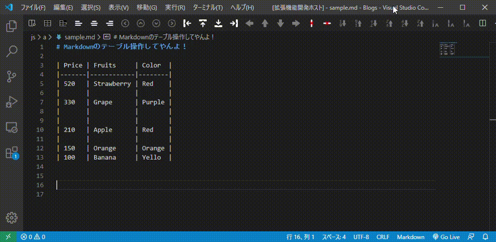
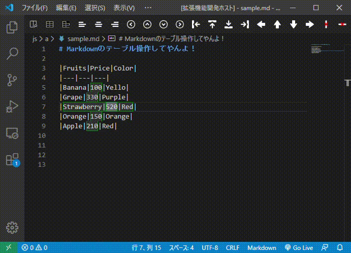
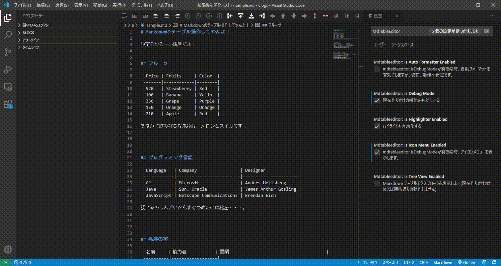

# Markdown Table Editor

**I use a translator.**

**I use a translator.**

## Features

Supports Markdown table editing.

### New create

Example: input the `3x7` and Enter Key.

Completion works by entering a number from 1 to 9 at the beginning of the line and `x` at the second character.
If you enter two or more digits, it will not respond.

### Focus

* `Shift + Alt + Allow(left, right, up, down)`: Move between cells.

### alignment change

### Move

### Remove

### Sort

Non-numeric rows are ignored when doing a numeric sort.
At the time of character string sorting, empty characters are also subject to sorting, but the specifications are undecided.

### Multi Selection

You can select **blank cell**, **nonblank cell**, **all cells** in the column.
For example, it is used when initializing only unentered cells.

### Format

Due to design changes, **natural format** works the same as **pretty format**.
It's not a bug, but the specification is undecided.

The difference between the two command icons is whether to fill empty cells.

## Extension Settings

* `mdtableeditor.isDebugMode`: Deprecated.
* `mdtableeditor.isIconMenuEnabled`: Displays the command icon.
* `mdtableeditor.isAutoFormatterEnabled`: Format automatically. It will be abolished.
* `mdtableeditor.isTreeViewEnabled`: Display the list of tables on the page in TreeView.
* `mdtableeditor.isHighlighterEnabled`: Do not highlight (green one).

Auto Formatter has not been confirmed to work on other than Windows.
It is for development and should not be enabled.
It will be abolished soon because it is made quite impossible.

Reason.
Auto Formatter internally uses setTimeout(), and the cursor position may shift depending on the timing of keyboard input.
I was tenacious, but I couldn't solve it.
I don't think it's the right way to go, but I didn't find it when I looked for a formal way.

Side note: I really wanted to write it, really. I'm scared of lack of sleep orz

## Known Issues

* Almost no Key Binding is set. It was a hassle to find out if it conflicted with another key.
* There are many files, but we do not bundle them with WebPack because we do not have time.

## Release Notes

### 0.0.1

June 06, 2020 A memorable release date♪

-------------------------------------------------- -------------------------------------------------- -------

## Thanks

Icon materials(part): https://icooon-mono.com/

## Meeeeeeeeeeeeeeee!

Developer HP: https://incre-clover.net

Developer Twitter: https://twitter.com/clover_plpl

