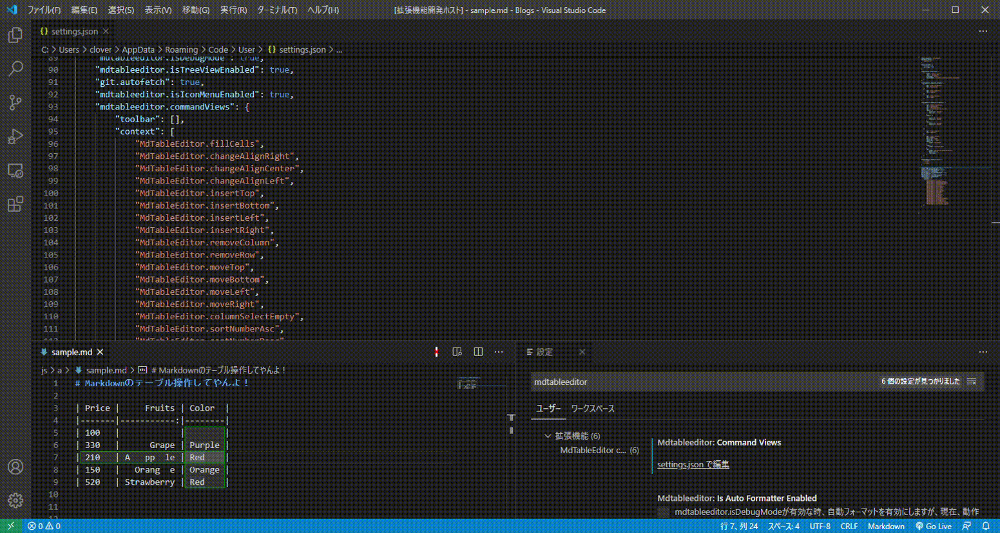

# MdTableEditor

Edit table

## GitHub Document links

https://github.com/clover-plpl/vsc-md-table-editor/blob/master/README.md

えーと、日本語はこっち。

https://github.com/clover-plpl/vsc-md-table-editor/blob/master/README.jp.md

## Features

Supports markdown table editing.

### New create

Example: input the `3x7` and Enter Key.

Completion works by entering a number from 1 to 9 at the beginning of the line and `x` at the second character.
If you enter two or more digits, it will not respond.

### Focus

* `Shift + Alt + Allow(left, right, up, down)`: Move between cells.

### alignment change

### Move

### Remove

### Sort

Non-numeric rows are ignored when doing a numeric sort.
At the time of character string sorting, blank characters are also subject to sorting, but the specifications are undecided.

### Multi Selection

You can select **blank cell**, **nonblank cell**, **all cells** in the column.
For example, it is used when initializing only unentered cells.

### Format

Due to design changes, **natural format** works the same as **pretty format**.
It's not a bug, but the specification is undecided.

The difference between the two command icons is whether to fill empty cells.

### selectable icons (TitleBar icons and Context menu icons)

* You can select the icon to be displayed as in the above example.
* To select the item displayed in the context menu, you can set it by right-clicking while editing Markdown.

Selecting a category will activate all menus belonging to it.

## Extension Settings

* `mdtableeditor.isDebugMode`: Deprecated.
* `mdtableeditor.isIconMenuEnabled`: Displays the command icon.
* `mdtableeditor.isAutoFormatterEnabled`: Format automatically. It will be abolished.
* `mdtableeditor.isTreeViewEnabled`: Display the list of tables on the page in TreeView.
* `mdtableeditor.isHighlighterEnabled`: Do not highlight (green one).

Auto Formatter has not been confirmed to work on other than Windows.
It is for development and should not be enabled.
It will be abolished soon because it is made quite impossible.

Reason.
Auto Formatter internally uses setTimeout(), and the cursor position may shift depending on the timing of keyboard input.
I was tenacious, but I couldn't solve it.

## Known Issues

* Almost no Key Binding is set.

## Release Notes

### 0.0.1

June 06, 2020 A memorable release date♪

### 0.0.2

* Toolbar icons and context menus no longer appear when not in table edit mode.
* You can now select the toolbar icon to display and the context menu.
* Fixed multiple bugs with multibyte characters.

-------------------------------------------------- -------------------------

## Icon materials (partial):

MONO: https://icooon-mono.com/

## About me

Developer HP: https://incre-clover.net

Developer Twitter: https://twitter.com/clover_plpl